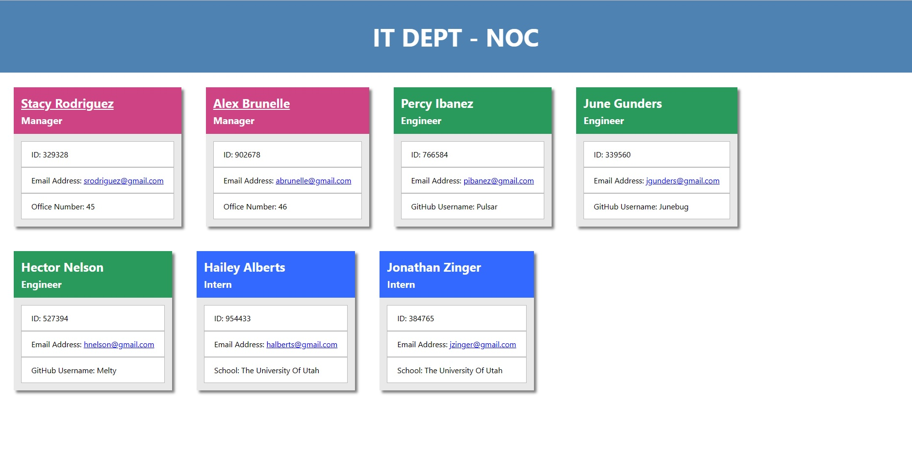

# Team Page Generator
A simple CLI program that takes information about your team and generates a webpage to display that information.

## Pitch
Are you managing a small commercial team, or collaborating with a few other programmers on a passion project? Tired of losing important info about your team members? Look no further than this Team Page Generator. Just enter all of your team's info into the terminal (such as Employee ID, email address, and GitHub username), and a simple HTML file will be generated with quick links to help you stay organized and connected to your team members.

## Installation and Usage
You can view a walkthrough video for this program [here](https://youtu.be/tVeEKDUaeVA), or simply follow the written instructions below.

To use the Team Page Generator:
1. Fork this repository
2. Open a bash/CMD/powershell terminal in the root folder
3. Enter `npm i` to install the project dependencies (Inquirer and Jest)
4. Enter `node index.js` to start the software
5. Follow the prompts, enter your data, and generate the Team Page
6. Locate your completed Team Page in the `dist/` folder

## Sample
The `sample` folder contains a sample Team Page generated using this software. The screenshot above shows what this sample looks like.

## Tests
To ensure the logic is intact in your copy of the software, you can run the included unit tests. Run the command `npm test` in your terminal to do so. If all tests pass, you're good to go! If a test fails, please [report it in the Issues section](https://github.com/Sumtwelve/teampage-generator/issues/new).

## How To Contribute
This program is rather simplistic, but any suggestions to its improvements are welcome. Once you've forked the repo, you can customize it however you like, and then open a merge request if you feel so inclined. You can also send any correspondence or inquiries to sumtwelve@gmail.com. Thanks!